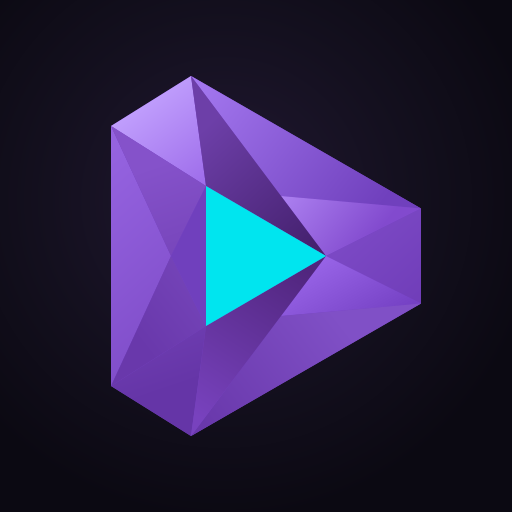
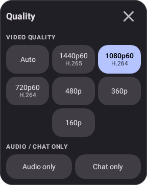
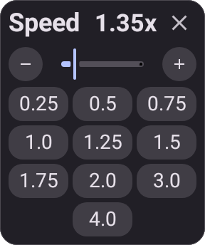
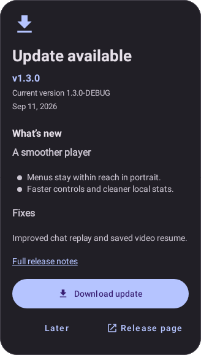

<p align="center">
  
</p>

<h1 align="center">ThystTV</h1>

<p align="center">
  A better Twitch client for Android, focused on player polish, floating chat, local viewing stats, and large-screen comfort.
</p>

<p align="center">
  <a href="https://github.com/tzii/ThystTV/releases/latest"></a>
  <a href="https://github.com/tzii/ThystTV/actions/workflows/ci.yml"></a>
  <a href="https://github.com/tzii/ThystTV/blob/master/LICENSE"></a>
  
</p>

<p align="center">
  <a href="#screenshots">Screenshots</a>
  ·
  <a href="#what-thysttv-adds">Features</a>
  ·
  <a href="#build-from-source">Build</a>
  ·
  <a href="#credit">Credit</a>
</p>

---

## What is ThystTV?

**ThystTV** is a third-party Twitch client for Android. It is based on [Xtra](https://github.com/crackededed/Xtra), with ThystTV-specific work aimed at making the viewing experience cleaner, faster, and more comfortable on phones, tablets, and large displays.

The `1.3` release line brings consistent player overlays, pinch display controls, clearer local Stats, live discovery and a more resilient updater. See the [1.3 release notes](docs/release-notes/1.3.0.md) for the changes and upgrade guidance.

> ThystTV is a fork of Xtra. A lot of credit goes to the Xtra project for the foundation this app builds on.

## Project status

| Area | Current detail |
|---|---|
| Repository | [`tzii/ThystTV`](https://github.com/tzii/ThystTV) |
| Active branch | [`master`](https://github.com/tzii/ThystTV/tree/master) |
| Published release | [Latest available APK](https://github.com/tzii/ThystTV/releases/latest) |
| Version in this branch | [`1.3.0`](docs/release-notes/1.3.0.md) |
| License | [GNU AGPL-3.0](LICENSE) |
| Primary language | Kotlin, with Java components |

## Screenshots

**1.3 UI previews.** These are native renders of the Android layouts with sample
data, including example update details. The Speed preview uses enlarged text.
See [preview sources](docs/images/review-1.3/README.md) for their provenance.

<table>
  <tr>
    <td width="50%" align="center" valign="top">
      <strong>Video quality</strong><br><br>
      
    </td>
    <td width="50%" align="center" valign="top">
      <strong>Playback speed · enlarged text</strong><br><br>
      
    </td>
  </tr>
</table>

<table>
  <tr>
    <td width="50%" align="center" valign="top">
      <strong>Local Stats</strong><br><br>
      
    </td>
    <td width="50%" align="center" valign="top">
      <strong>Updater and release notes</strong><br><br>
      
    </td>
  </tr>
</table>

## Floating chat

Floating chat is one of ThystTV's headline viewing upgrades. It keeps chat available during full-screen playback without forcing the player into a cramped split layout.

The device demo below was recorded before 1.3. The gallery above shows the current
player controls and updater layouts.

<p align="center">
  
</p>

https://github.com/user-attachments/assets/99d97579-3340-4200-8aa7-3cae0414560e

<p align="center">
  <a href="docs/images/readme/floating-chat.mp4">Download the floating chat demo video</a>
</p>

## What ThystTV adds

### Player refinement

- Gesture-based playback controls for horizontal seek, playback speed, brightness, and volume.
- Pinch between Fit and Fill in landscape, with Stretch available in display settings.
- Quality, Speed, Stream volume and More share consistent overlays with reachable controls.
- Clearer feedback while interacting with the player.
- Better visual handling for minimized player states.
- VoD scrubbing improvements that scale with video duration.

### Floating chat

- Chat overlay designed for full-screen viewing.
- A cleaner way to keep stream context visible while the video remains primary.
- Better fit for phones, tablets, and wide layouts.

### Local stats

- Watch-history and screen-time insights.
- Category breakdowns and viewing patterns.
- Favorite channel and session-focused views.
- Stats stay local on the device.

### Updater and changelog

- In-app update checks with release details.
- Changelog previews before downloading a new build.
- Direct links to the GitHub release when more context is needed.

### Large-screen comfort

- Layout work for tablets and wider Android screens.
- Player and browsing screens tuned to avoid cramped controls.
- Player menus and Stats adapt to enlarged text and resized windows.

## Build from source

Recommended local setup:

- Android Studio, current stable release
- JDK 21
- Android SDK matching the project configuration

```bash
./gradlew assembleDebug
./gradlew test
./gradlew assembleRelease
```

On Windows:

```powershell
.\gradlew.bat assembleDebug
.\gradlew.bat test
.\gradlew.bat assembleRelease
```

## Download and install

Download the latest APK from [GitHub Releases](https://github.com/tzii/ThystTV/releases/latest). Each release includes an APK checksum; verify the package, checksum, and official signing certificate with the [APK verification guide](docs/APK_VERIFICATION.md) before installing or upgrading.

ThystTV is distributed independently. It is not affiliated with, endorsed by, or sponsored by Twitch Interactive or Amazon.

## Documentation

- [Roadmap](docs/ROADMAP.md)
- [Testing guide](docs/TESTING.md)
- [Manual QA](docs/MANUAL_QA.md)
- [Player notes](docs/PLAYER.md)
- [Gesture system](docs/GESTURE_SYSTEM.md)
- [Release process](docs/RELEASE_PROCESS.md)
- [1.3 release notes](docs/release-notes/1.3.0.md)
- [Distribution policy](docs/DISTRIBUTION.md)
- [APK verification guide](docs/APK_VERIFICATION.md)
- [Security policy](SECURITY.md)
- [Upstream sync policy](docs/UPSTREAM_SYNC.md)
- [Upstream sync ledger](docs/UPSTREAM_SYNC_LEDGER.md)
- [Visual identity](docs/VISUAL_IDENTITY.md)

## Contributing

Contributions should stay focused, reviewable, and easy to test. For UI work, include screenshots. For player or gesture changes, include manual test notes for live playback, VoDs, orientation changes, and minimize/restore behavior. Report bugs through [GitHub Issues](https://github.com/tzii/ThystTV/issues).

Read [CONTRIBUTING.md](CONTRIBUTING.md) before opening a non-trivial pull request.

## Credit

ThystTV is based on [Xtra](https://github.com/crackededed/Xtra). The upstream project deserves major credit for the base client, architecture, and years of work that made this fork possible.

## License

ThystTV is licensed under the [GNU Affero General Public License v3.0](LICENSE).
