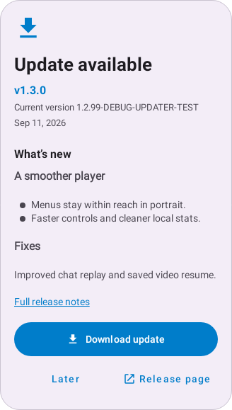
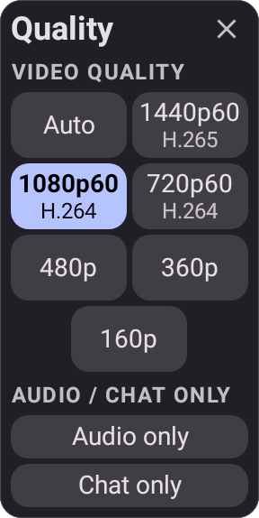
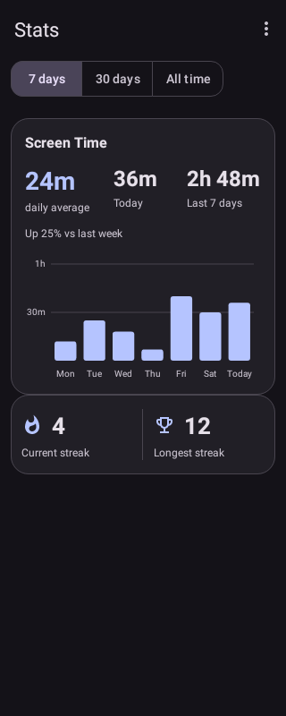

# ThystTV 1.3 review guide

ThystTV 1.3 improves player controls, gestures, Stats and live discovery, fixes
selected chat/playback defects, and hardens updater state and installer handling.
This draft PR is prepared for Astra Pro web review.

Review the complete diff from master at
`e78afcdb5c94220f8244c2a34278c2b2b12fc326` to the PR's current head. The release
includes the functionality from [player PR #21](https://github.com/tzii/ThystTV/pull/21)
and subsequent fixes. This branch starts directly from master and contains the
selected public source snapshot, rather than internal development history.

## Review map

Paths beginning with `ui/`, `util/` or `repository/` are beneath
`app/src/main/java/com/github/andreyasadchy/xtra/`; `res/` is beneath `app/src/main/`.
Corresponding regression tests are in `app/src/test/`.

| Area | Entry points | Questions |
| --- | --- | --- |
| Updater state and installation | `util/update/`, `ui/common/UpdateDialogController.kt`, MainActivity, SettingsActivity, AndroidManifest.xml | Can cancelled, stale or forged callbacks launch UI? Does one owner retain the attempt through pause/recreation? Are permission, timeout and retry paths recoverable? |
| Updater UI | UpdateAvailableDialog, UpdateDialogWindow, UpdateSheetLayout, UpdateDownloadUi, `res/layout/dialog_update_*.xml` | Are Markdown, actions and scrolling reachable with large text and while a window resizes? |
| Player and gestures | `ui/player/PlayerFragment.kt`, PlayerSystemUiListener, PlayerGestureArbiter, PinchDisplayModeController, PlayerDisplayModeStore, popup binders | Check teardown, gesture conflicts, mini-player/portrait Fit constraints, quality labels, popup dismissal and migration. |
| Stats and live discovery | `ui/stats/`, DailyBarChartView, ChannelSearchMapper, SearchChannelsDataSource, `ui/search/channels/` | Check rapid range changes, tiny totals, large text, stream identity, paging and stale live results. |
| Correctness ports | ChatReplayTiming, FollowedChannelsDataSource, TwitchEmoteSuggestions, SocialLinkLabel, MediaSeekFallback, VideoResumePosition, HeadingFixPlugin | Preserve cancellation, paging results, existing autocomplete entries, explicit timestamps and single event handling. Source commits are recorded in UPSTREAM_SYNC_LEDGER.md. |
| Resources and branding | `res/values-*/strings.xml`, launcher resources, `docs/images/icons/launcher/` | Verify baseline translation wording, encoding, adaptive/themed geometry and fallbacks. |
| Build and release | `app/build.gradle.kts`, `scripts/release/verify-apk*`, `.gitattributes`, CI workflows and release notes | Version is 1.3.0/code 12. Verify native Windows quoting/failures, certificate checking and unchanged official signing/promotion boundaries. |

## Validation

- Normal `test lintDebug assembleDebug assembleRelease` passed: 488 Android tests,
  0 failures/errors/skips; lint 0 errors and 342 existing warnings. Release assembly
  is unsigned. Android adapter/resource tests supplement production-core tests.
- Repository tests passed on Windows: 55 passes and two POSIX-only skips, including
  all five native Windows verifier cases. Source contracts and shell syntax passed.
- The public app/build source matches the validated 1.3 implementation. GitHub CI
  provides fresh results for the pushed PR head; inspect those checks separately.
- Device testing confirmed a same-package debug update completed, About showed
  1.3.0-DEBUG, and settings/saved data remained intact. The test used equal version
  codes, so the official 1.2.1-to-signed-1.3 upgrade remains required.
- Earlier player, Stats, selected-port and listener testing was accepted. The final
  signed candidate still requires its own regression pass.

No internal plans, raw review/QA records, local updater fixture, APKs, private keys
or device attachments are included in this review branch.

## Visual references

These native Robolectric sample-data renders illustrate layout; they are not device
screenshots or proof of OS installation. The updater's displayed current version
and release notes are fixture values from the test build.

| Updater, normal text | Quality, 200% text | Stats, normal text |
| --- | --- | --- |
|  |  |  |

## Known limits and remaining verification

- Downloads are buffered and in-process. Process death requires an explicit new
  attempt. Cronet/HttpEngine may report only final progress.
- Device cancellation/retry, network interruption, denied install permission,
  background/rotation and enlarged layouts have not all been confirmed.
- Before release, test the exact official signed candidate upgrading 1.2.1,
  preserving account/settings/Stats/bookmarks/downloads and migrating display mode.
  Repeat live/VoD, switching, close/reopen, minimize/PiP, gestures, menus, floating
  chat, Stats and launcher checks on those bytes.
- Review and signed-candidate requirements are in [RELEASE_PROCESS.md](RELEASE_PROCESS.md).
  Source review does not authorize merging, signing or publishing.

## Requested review output

Report actionable correctness, security, lifecycle, compatibility or regression
findings with file/line references, a trigger, impact and proposed fix. Distinguish
verified defects from hypotheses and missing device evidence. Review the whole
diff and identify any untested assumptions. Finish with blocking findings and
remaining test gaps; passing tests alone are not proof that the code is correct.
